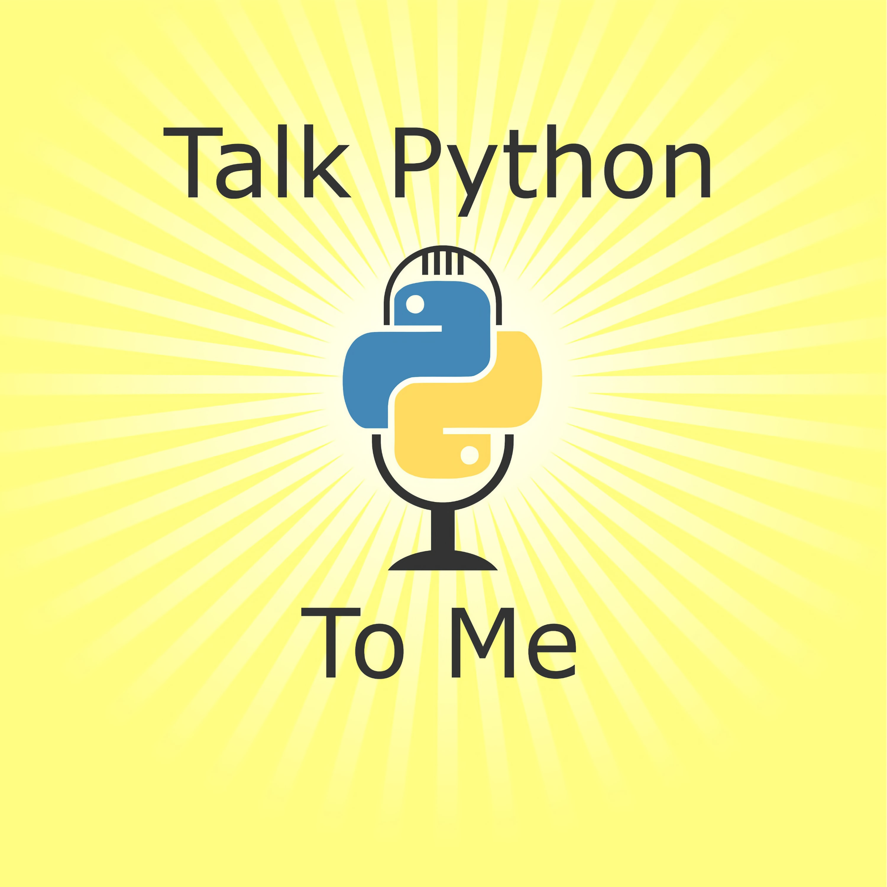
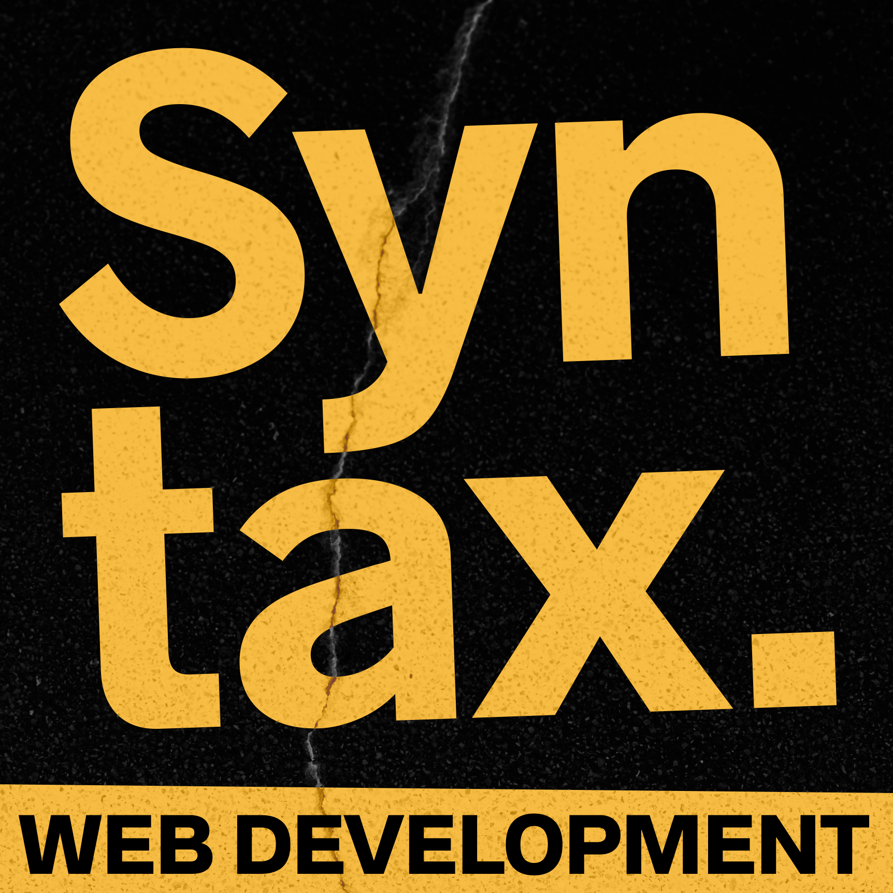
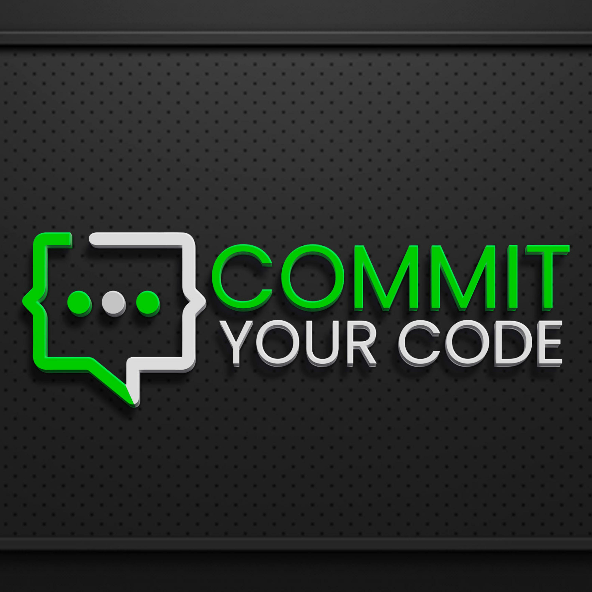
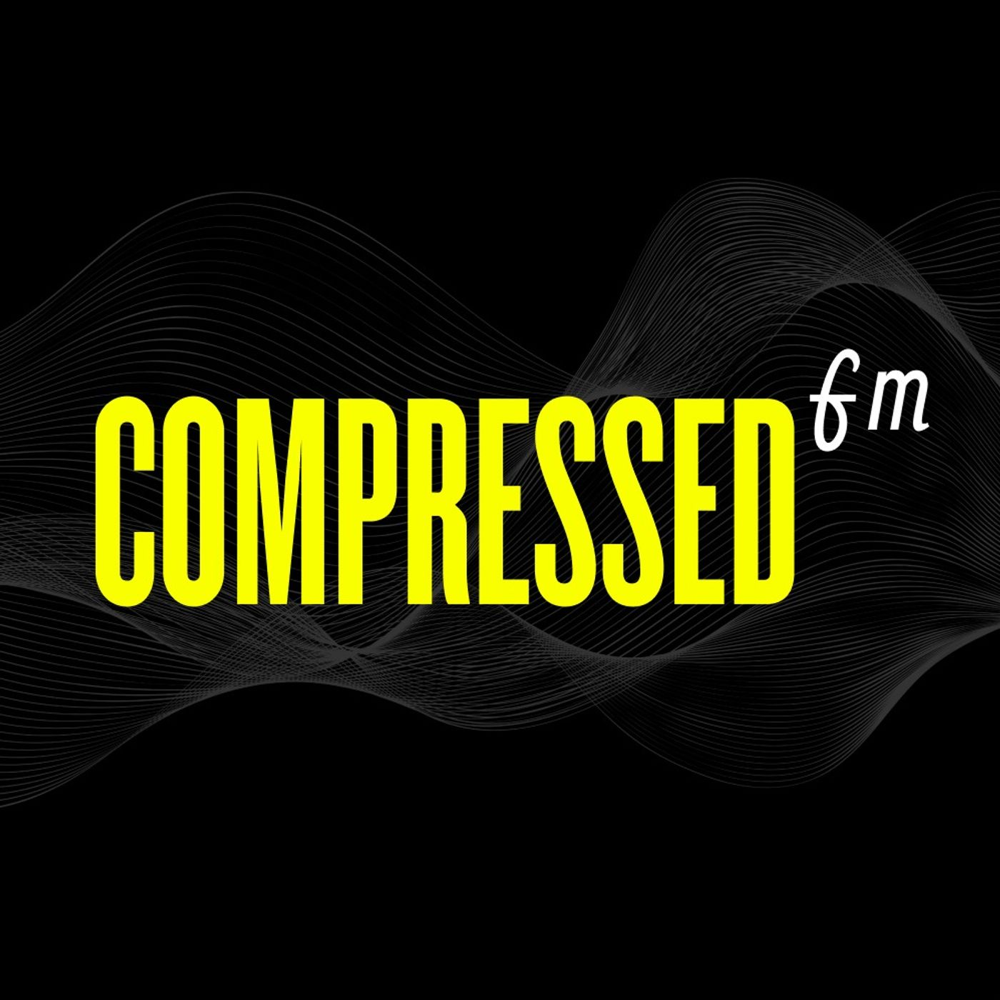
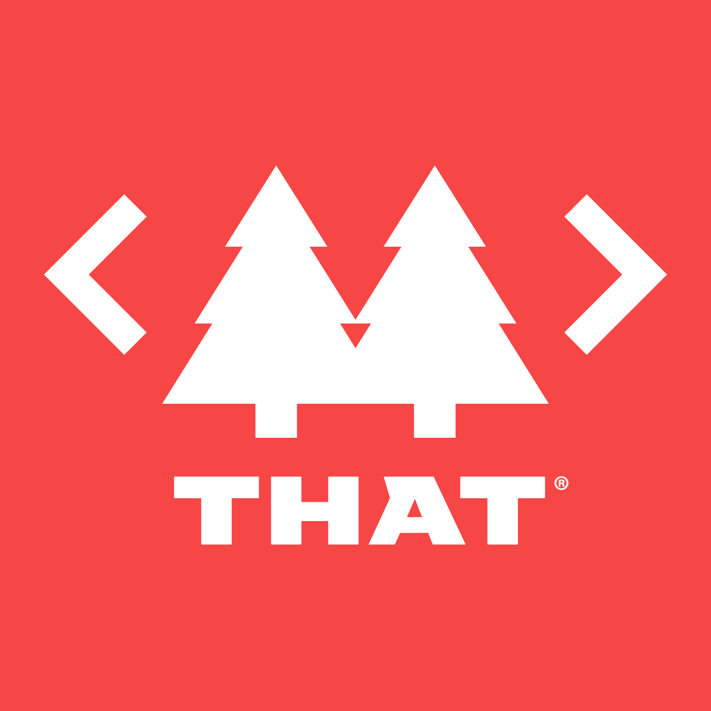
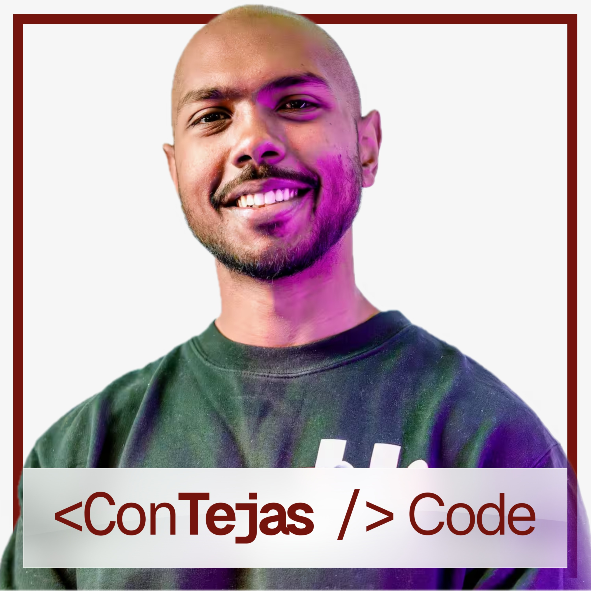

# My favorite Podcasts

<h3 id="talk-python-to-me">Talk Python To Me</h3>

Talk Python to Me is a weekly podcast hosted by developer and entrepreneur Michael Kennedy. We dive deep into the popular packages and software developers, data scientists, and incredible hobbyists doing amazing things with Python. If you're new to Python, you'll quickly learn the ins and outs of th...

* Number of published episodes: 488
* [Talk Python To Me Website](https://talkpython.fm/)
* [Talk Python To Me Feed](https://talkpython.fm/episodes/rss)
* Tags: python
, programming

----

<h3 id="syntax-tasty-web-development-treats">Syntax - Tasty Web Development Treats</h3>

Full Stack Developers Wes Bos and Scott Tolinski dive deep into web development topics, explaining how they work and talking about their own experiences. They cover from JavaScript frameworks like React, to the latest advancements in CSS to simplifying web tooling....

* Number of published episodes: 864
* [Syntax - Tasty Web Development Treats Website](https://syntax.fm)
* [Syntax - Tasty Web Development Treats Feed](https://feed.syntax.fm/rss)
* Tags: Web Development, JavaScript, Full-Stack

----

<h3 id="commit-your-code">Commit Your Code!</h3>

This is the Commit Your Code Podcast! A show about software development, technology, and the developers that use it! Each Episode will Have 3 guests!
- 1 Special Guest Host
- 1 Technical Guest
- 1 Junior Developer who has landed a job in tech within the last 18 months!
I am your host, Danny Thompson...

* Number of published episodes: 10
* [Commit Your Code! Website](https://podcasters.spotify.com/pod/show/commityourcode)
* [Commit Your Code! Feed](https://anchor.fm/s/1cd48480/podcast/rss)
* Tags: Web Development, JavaScript

----

<h3 id="compressedfm">COMPRESSEDfm</h3>

A weekly podcast about web design and development with a little zest from James Q Quick, Amy Dutton, Brad Garropy, and Bekah HW....

* Number of published episodes: 192
* [COMPRESSEDfm Website](http://compressed.fm)
* [COMPRESSEDfm Feed](https://feeds.simplecast.com/hq7M2S7s)
* Tags: JavaScript, Web Development, Web Design

----

<h3 id="that">THAT</h3>

Welcome to THAT, a daily podcast hosted by Clark Sell and the crew at THAT Conference.  

Our goal with this podcast is simple. I want to tell your story. I want to document these experiences in such that we can all help one another. I know that sounds a bit abstract, but over the years, I’ve talked...

* Number of published episodes: 76
* [THAT Website](http://askthat.libsyn.com/website)
* [THAT Feed](https://askthat.libsyn.com/rss)
* Tags: THAT Conference, Open Source, Web Development

----

<h3 id="contejas-code">ConTejas Code</h3>

ConTejas Code is a podcast in the web engineering space that has deep dives on various topics between frontend engineering with React, TypeScript, Next.js, and backend engineering with Kafka, Postgres, and more. The series is a mix of long-form content and guest episodes with industry leaders in the...

* Number of published episodes: 62
* [ConTejas Code Website](https://shows.acast.com/contejas-code)
* [ConTejas Code Feed](https://feeds.acast.com/public/shows/655148df2861630012a1d01b)
* Tags: Open Source, Web Development, JavaScript

----

