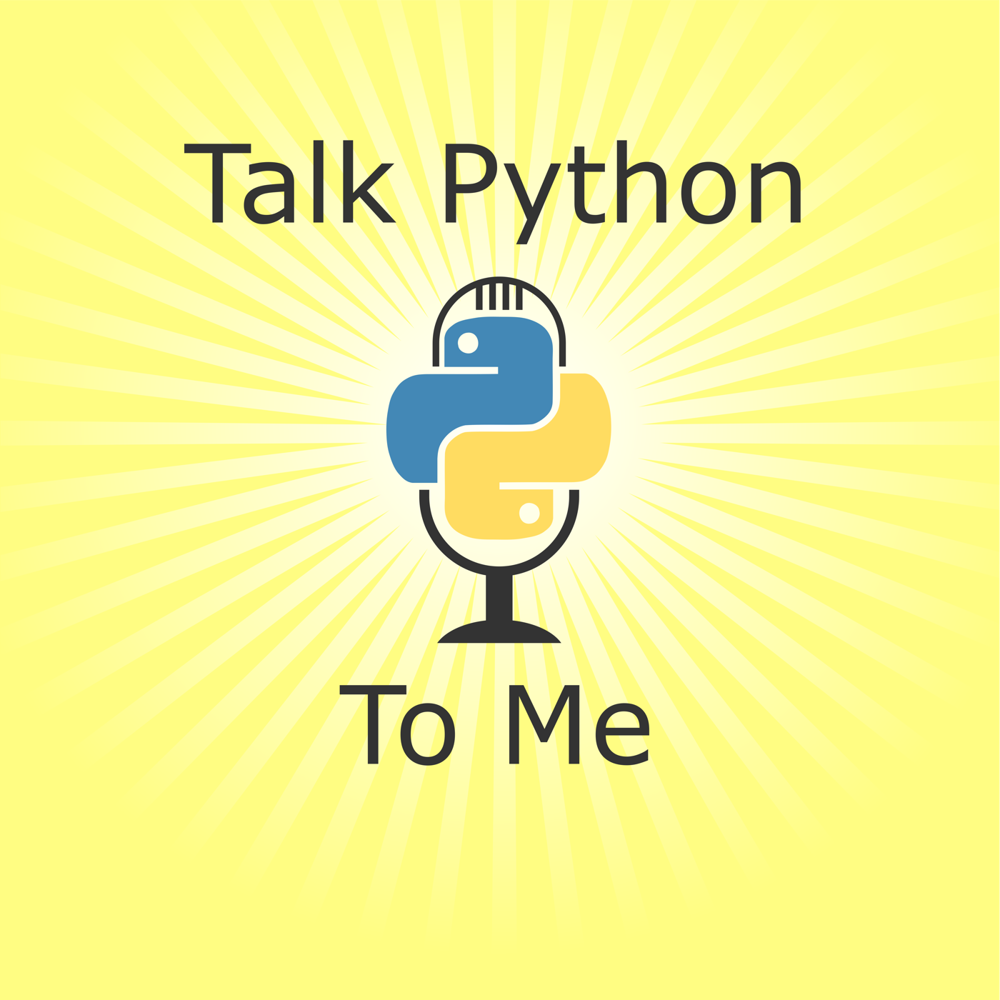

# My favorite Podcasts

<h3 id="syntax-tasty-web-development-treats">Syntax - Tasty Web Development Treats</h3>

Full Stack Developers Wes Bos and Scott Tolinski dive deep into web development topics, explaining how they work and talking about their own experiences. They cover from JavaScript frameworks like React, to the latest advancements in CSS to simplifying web tooling....

* Number of published episodes: 799
* [Syntax - Tasty Web Development Treats Website](https://syntax.fm)
* [Syntax - Tasty Web Development Treats Feed](https://feed.syntax.fm/rss)
* Tags: Web Development, JavaScript, Full-Stack

----

<h3 id="talk-python-to-me">Talk Python To Me</h3>

Talk Python to Me is a weekly podcast hosted by developer and entrepreneur Michael Kennedy. We dive deep into the popular packages and software developers, data scientists, and incredible hobbyists doing amazing things with Python. If you're new to Python, you'll quickly learn the ins and outs of th...

* Number of published episodes: 469
* [Talk Python To Me Website](https://talkpython.fm/)
* [Talk Python To Me Feed](https://talkpython.fm/episodes/rss)
* Tags: python
, programming

----

