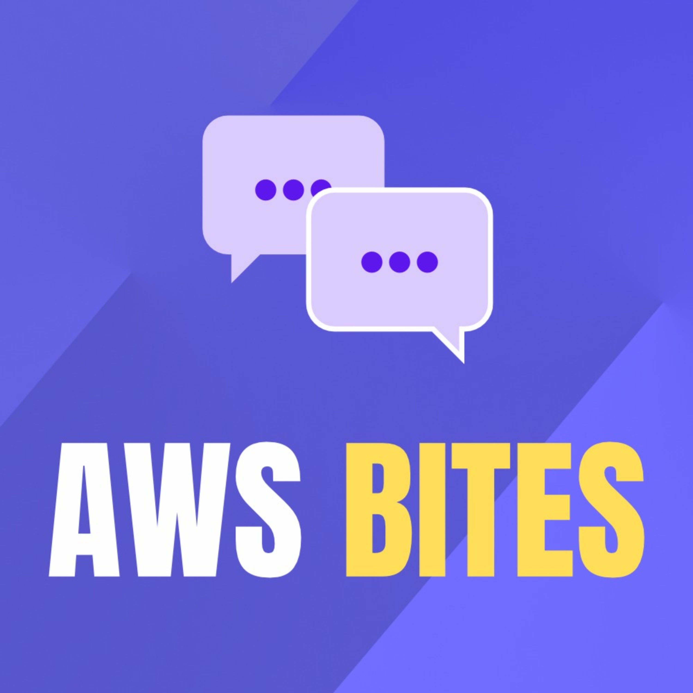
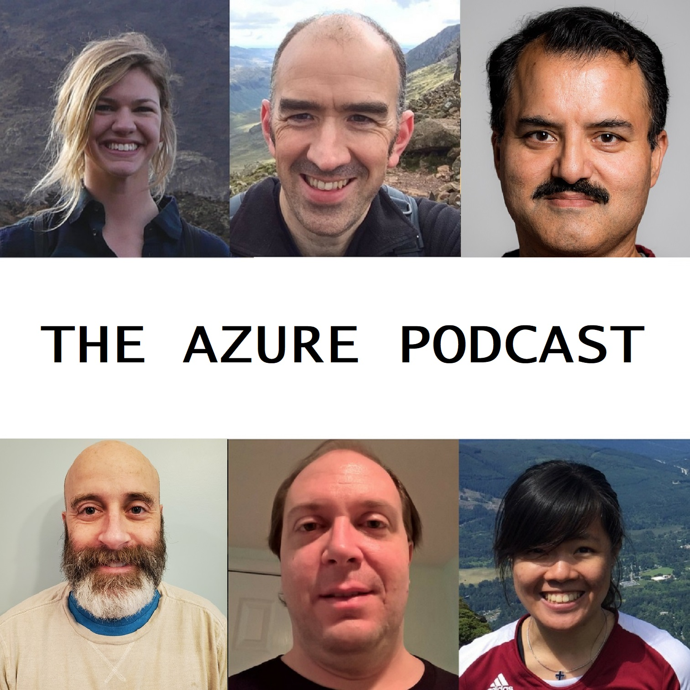
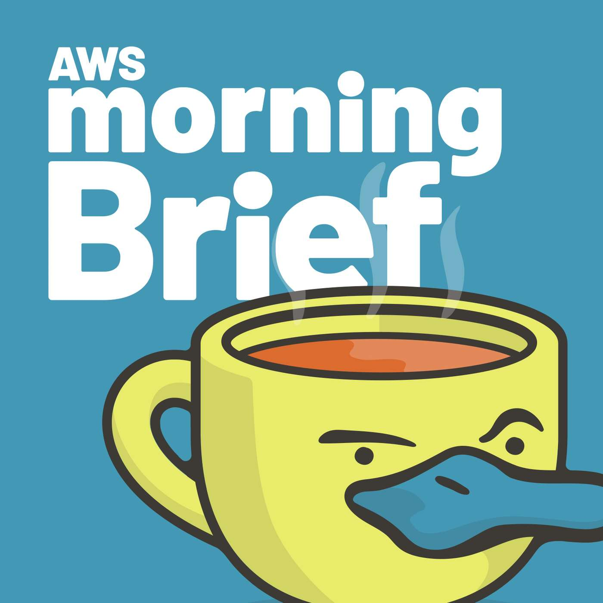

# My favorite Podcasts

<h3 id="aws-bites">AWS Bites</h3>

AWS Bites is the show where we answer questions about AWS! This show is brought to you be Eoin Shanaghy and Luciano Mammino, certified AWS experts....

* Number of published episodes: 152
* [AWS Bites Website](https://awsbites.com)
* [AWS Bites Feed](https://anchor.fm/s/6a3312a0/podcast/rss)
* Tags: shorts, aws, cloud

----

<h3 id="hadith-tech-tech-talks">Hadith Tech (tech talks)</h3>

A podcast that host fireside interviews with tech leaders and role models to talk about their experience, career and life....

* Number of published episodes: 9
* [Hadith Tech (tech talks) Website](https://podcasters.spotify.com/pod/show/hadith-tech-en)
* [Hadith Tech (tech talks) Feed](https://anchor.fm/s/72e08798/podcast/rss)
* Tags: tech, open source

----

<h3 id="the-azure-podcast">The Azure Podcast</h3>

Cynthia Kreng, Kendall Roden, Cale Teeter, Evan Basalik, Russell Young & Sujit D'Mello work at Microsoft in the cloud and services area. They specialize in building and supporting enterprise apps and services that leverage the cloud....

* Number of published episodes: 100
* [The Azure Podcast Website](http://azpodcast.azurewebsites.net/)
* [The Azure Podcast Feed](http://feeds.feedburner.com/TheAzurePodcast)
* Tags: azure, cloud, programming

----

<h3 id="talk-python-to-me">Talk Python To Me</h3>

Talk Python to Me is a weekly podcast hosted by developer and entrepreneur Michael Kennedy. We
            dive deep into the popular packages and software developers, data scientists, and incredible hobbyists doing
            amazing things with Python. If you're new to Python, you'll quickly lear...

* Number of published episodes: 517
* [Talk Python To Me Website](https://talkpython.fm/)
* [Talk Python To Me Feed](https://talkpython.fm/episodes/rss)
* Tags: python, programming

----

<h3 id="aws-morning-brief">AWS Morning Brief</h3>

The latest in AWS news, sprinkled with snark. Posts about AWS come out over sixty times a day. We filter through it all to find the hidden gems, the community contributions--the stuff worth hearing about! Then we summarize it with snark and share it with you--minus the nonsense....

* Number of published episodes: 686
* [AWS Morning Brief Website](https://www.lastweekinaws.com)
* [AWS Morning Brief Feed](https://feeds.transistor.fm/aws-morning-brief)
* Tags: AWS, Brief, amazon

----

<h3 id="contejas-code">ConTejas Code</h3>

ConTejas Code is a podcast in the web engineering space that has deep dives on various topics between frontend engineering with React, TypeScript, Next.js, and backend engineering with Kafka, Postgres, and more. The series is a mix of long-form content and guest episodes with industry leaders in the...

* Number of published episodes: 88
* [ConTejas Code Website](https://shows.acast.com/contejas-code)
* [ConTejas Code Feed](https://feeds.acast.com/public/shows/655148df2861630012a1d01b)
* Tags: Open Source, Web Development, JavaScript

----

