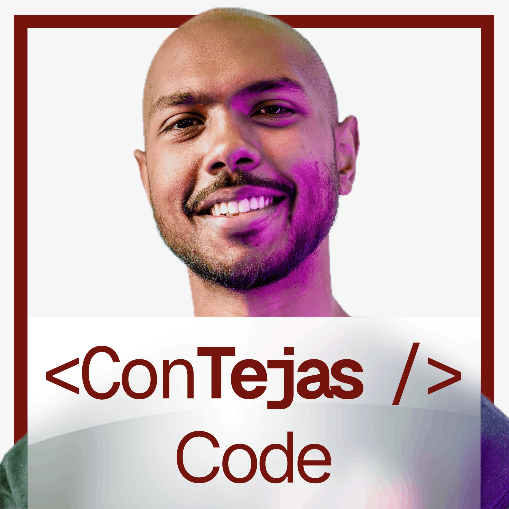

# My favorite Podcasts

<h3 id="contejas-code">ConTejas Code</h3>

ConTejas Code is a podcast in the web engineering space that has deep dives on various topics between frontend engineering with React, TypeScript, Next.js, and backend engineering with Kafka, Postgres, and more. The series is a mix of long-form content and guest episodes with industry leaders in the...

* Number of published episodes: 88
* [ConTejas Code Website](https://shows.acast.com/contejas-code)
* [ConTejas Code Feed](https://feeds.acast.com/public/shows/655148df2861630012a1d01b)
* Tags: Open Source, Web Development, JavaScript

----

